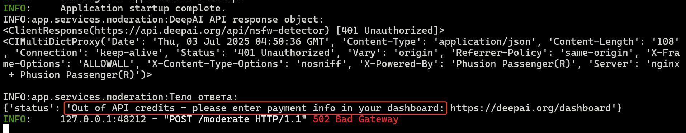

# DeepAI NSFW API

## ПРИМЕЧАНИЕ

### **DeepAPI требует ввода данных банковской карты для работы с API. Без этого даже запрос с API-ключом приводит к ошибке:**




## Структура проекта

```
.
├── app/
│   ├── api/
│   │   └── routes.py
│   ├── core/
│   │   └── config.py
│   ├── services/
│   │   └── moderation.py
│   └── main.py
├── .env
├── requirements.txt
└── README.md
```

## Установка и запуск

1. Клонировать репозиторий:

```bash
$ git clone https://github.com/AlexanderKurenkov/deepai-nsfw-api.git
$ cd deepai-nsfw-api
````

2. Создать и активировать виртуальное окружение:

```bash
python -m venv venv
source venv/bin/activate  # Linux/macOS
venv\Scripts\activate     # Windows
```

3. Установть зависимости:

```bash
pip install -r requirements.txt
```

4. Создать `.env` в корне проекта на основе .env.example, указав значение API-ключа:

```
DEEP_AI_API_KEY=your_api_key_here
```

5. Запустить сервер:

```bash
uvicorn app.main:app --reload
```

## Конечная точка

* `POST /moderate`: принимает изображение, возвращает статус модерации (`REJECTED` или `OK`)

Пример запроса через curl:

```bash
curl -X POST -F "file=@example.jpg" http://localhost:8000/moderate
```
